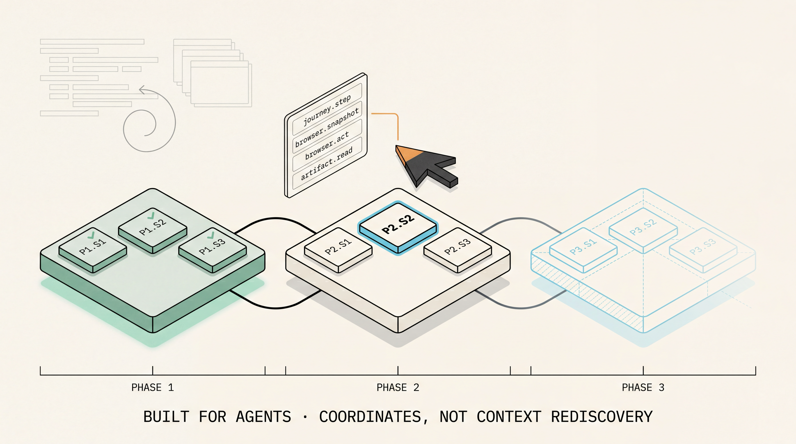
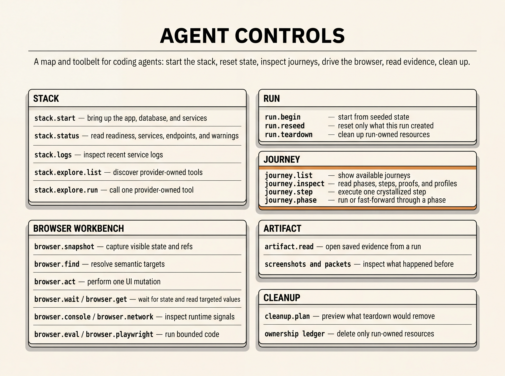
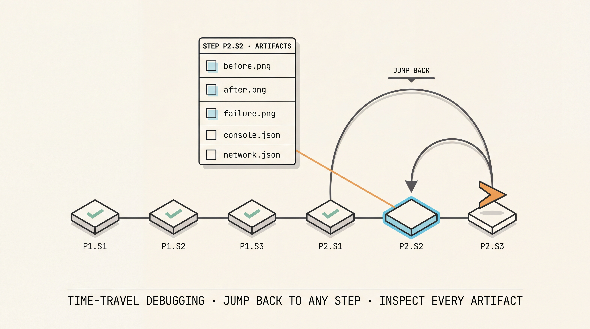

# Agent E2E Harness

A reusable proof-loop toolkit for **agent-built development** — the workflow where coding agents implement changes and must produce **Deterministic Proof** that the change works.



When a coding agent makes a change, the proof that it works should not be a "looks good on my machine" screenshot or a hand-waved transcript. Agent E2E Harness gives the agent an **Executable Journey** — a seeded environment, MCP-callable phase/step controls, an **MCP-Owned Browser Session**, per-step artifacts, and an **Ownership Ledger** that bounds what cleanup may delete. The same journey that produces a Deterministic Proof during development crystallizes, unchanged, into a **CI E2E Test**.

The agent is the primary user. Humans and CI read the same artifacts the agent left behind.

## Install in 5 minutes

The whole path: install the package, declare a config, start the Dev MCP server, point a standard Streamable HTTP MCP client at it, list tools. The journey itself is the only domain code you write — the rest is a one-line CLI and an `agent-e2e.config.ts`.

**1. Install the harness and its runtime peers.**

```sh
npm install -D @agent-e2e/harness playwright @modelcontextprotocol/sdk zod
```

Expected output line:

```text
added N packages
```

**2. Install Bun `>=1.3.0`.** The Dev MCP CLI runs on Bun so `agent-e2e.config.ts` loads directly and the **Hot-Reloaded Journey Registry** can replace journey definitions behind a stable MCP URL.

```sh
bun --version
```

Expected:

```text
1.3.0
```

**3. Add the `dev:mcp` script** to the app's `package.json`:

```json
{
  "scripts": {
    "dev:mcp": "agent-e2e-harness dev-mcp"
  }
}
```

Verify:

```sh
npm pkg get scripts.dev:mcp
```

Expected:

```text
"agent-e2e-harness dev-mcp"
```

**4. Drop an `agent-e2e.config.ts` at the app root** with at least one journey, a stack provider, and a **Typed Resource Registry** (see the worked examples below for the shapes).

**5. Start Dev MCP and discover its tool surface.** Run:

```sh
npm run dev:mcp
```

Expected line in the server log:

```text
Dev MCP listening on http://127.0.0.1:3766/mcp
```

Then point any standard Streamable HTTP MCP client at `http://127.0.0.1:3766/mcp` and call `tools/list`. The first entry confirms the **Dev MCP Tool Grammar** is wired:

```text
stack.start
```

## Worked examples

The frozen v1.0 surface is small. These five examples cover the whole loop end-to-end: define the journey, register typed resources, drive tools through a standard MCP client, read run artifacts, and crystallize.

### 1. Define an Executable Journey

The journey is the **Inspectable Journey Contract** plus executable step handlers. Profiles, phases, steps, and proofs are data. Step `execute` and proof `check` are TypeScript handlers that bind to the **Execution Surface** declared in `HarnessTypes`.

```ts
import { defineJourney, type HarnessTypes } from "@agent-e2e/harness/core";

interface NotesObserved {
  noteId: string;
  noteVisible: boolean;
}

type NotesHarness = HarnessTypes<
  { appUrl: string },
  Record<string, never>,
  NotesObserved,
  { kind: "note"; id: string }
>;

export const createNoteJourney = defineJourney<NotesHarness>({
  id: "notes:create",
  title: "Create a note from the UI",
  profiles: [{ id: "default", isDefault: true, data: {} }],
  seed: async () => ({
    environment: {
      checked: [{ kind: "workspace", id: "agent-proof" }],
      created: [],
      forbidden: [{ kind: "note", id: "agent-created-note" }],
    },
  }),
  phases: [
    {
      id: "phase:notes",
      title: "Notes",
      steps: [
        {
          id: "step:create-note",
          title: "Create a note and verify it persists",
          execute: async ({ execution, runId }) => {
            const note = await execution.notes.findByTitle("Agent proof note");
            return {
              status: note ? "passed" : "failed",
              observed: { noteVisible: Boolean(note), noteId: note?.id ?? "" },
              ownedResources: note ? [{ kind: "note", id: note.id }] : [],
            };
          },
          proofs: [
            {
              id: "proof:note-visible",
              title: "The created note is visible in the app",
              check: ({ observed }) => observed.noteVisible === true,
            },
          ],
        },
      ],
    },
  ],
});
```

### 2. Register typed resources via the Typed Resource Registry

The **Typed Resource Registry** is the canonical v1.0 wiring. `defineResourceKind` types the creation input and binds the destruction mechanic; `createResourceRegistry` bundles kinds so `defineAgentE2EConfig` can resolve cleanup across every journey in the config.

```ts
import {
  createResourceRegistry,
  defineResourceKind,
} from "@agent-e2e/harness/core";

interface CreateNoteInput {
  baseUrl: string;
  body: string;
  runId: string;
}

interface OwnedNote {
  kind: "note";
  id: string;
  baseUrl: string;
}

const noteKind = defineResourceKind({
  kind: "note",
  create: async (input: CreateNoteInput): Promise<OwnedNote> => {
    const res = await fetch(`${input.baseUrl}/api/notes`, {
      method: "POST",
      headers: { "content-type": "application/json" },
      body: JSON.stringify({ body: input.body, runId: input.runId }),
    });
    if (!res.ok) throw new Error(`create note ${res.status}`);
    const { note } = await res.json() as { note: { id: string } };
    return { kind: "note", id: note.id, baseUrl: input.baseUrl };
  },
  delete: async (resource: OwnedNote) => {
    const res = await fetch(`${resource.baseUrl}/api/notes/${resource.id}`, {
      method: "DELETE",
    });
    if (!res.ok) throw new Error(`delete note ${resource.id} ${res.status}`);
  },
});

export const notesResourceRegistry = createResourceRegistry([noteKind]);
```

Wire it into the config alongside the journey and the **Stack Provider**:

```ts
import { defineAgentE2EConfig } from "@agent-e2e/harness/dev-mcp";
import { createNoteJourney } from "./journeys/notes-create.js";
import { notesResourceRegistry } from "./resources.js";
import { myStackProvider } from "./stack.js";

export default defineAgentE2EConfig({
  journeys: [createNoteJourney],
  resourceRegistry: notesResourceRegistry,
  stackProvider: myStackProvider,
});
```

The lower-level `resourceAdapters: [...]` field is still accepted for one-off cleanup mechanics that do not fit a typed kind; the registry is the canonical pattern.

### 3. Drive the loop from a standard Streamable HTTP MCP client

The Dev MCP server is a standard Streamable HTTP MCP endpoint. Any compliant client works — Claude Code, Cursor, Codex, a custom agent loop, or the official TypeScript SDK shown here. Tools live under `stack`, `run`, `journey`, `browser`, `artifact`, and `cleanup` groups.

```ts
import { Client } from "@modelcontextprotocol/sdk/client/index.js";
import { StreamableHTTPClientTransport } from "@modelcontextprotocol/sdk/client/streamableHttp.js";

const transport = new StreamableHTTPClientTransport(
  new URL("http://127.0.0.1:3766/mcp"),
);
const client = new Client(
  { name: "notes-agent", version: "0.0.0" },
  { capabilities: {} },
);
await client.connect(transport);

// Discovery + inspection.
const { tools } = await client.listTools();
const inspected = await client.callTool({
  name: "journey.inspect",
  arguments: { journeyId: "notes:create" },
});

// Lifecycle.
const stack = await client.callTool({ name: "stack.start", arguments: {} });
const begun = await client.callTool({
  name: "run.begin",
  arguments: { journeyId: "notes:create", profileId: "default" },
});

// Drive UI through the MCP-Owned Browser Session.
const session = await client.callTool({
  name: "browser.open",
  arguments: { url: stack.services?.[0]?.url, headed: true },
});
await client.callTool({ name: "browser.snapshot", arguments: { browserSessionId: session.browserSessionId } });

// Execute one step at a time, inspect, then proceed.
await client.callTool({
  name: "journey.step",
  arguments: { runId: begun.runId, stepId: "step:create-note" },
});

// Bounded cleanup and reseed.
await client.callTool({ name: "cleanup.plan", arguments: { runId: begun.runId } });
await client.callTool({ name: "run.reseed", arguments: { runId: begun.runId } });
```

`journey.inspect` returns the full **Inspectable Journey Contract** for one journey: phases, steps, proofs, profiles, and descriptions. Agents use it to plan; humans use it to read; CI uses it to diff.

### 4. Read the artifacts a run left behind

Every phase and step writes evidence under `.agents-e2e/artifacts/<journey>/<run>/`. The layout is contractual — agents and CI grep these filenames. `artifact.read` returns a typed packet without the agent having to know filesystem internals.

```ts
const result = await client.callTool({
  name: "artifact.read",
  arguments: {
    runId: begun.runId,
    path: "01-phase-phase:notes/01-step-step:create-note/step-feedback.json",
  },
});
```

The on-disk layout, in the order an agent typically reaches for it:

```text
.agents-e2e/artifacts/<journey>/<run>/
  seed-manifest.json
  result.json
  timeline.json
  metrics.json
  owned-resources.json
  cleanup-plan.json
  cleanup.json
  forensics/browser-snapshot-*.json
  forensics/screenshot-*.png
  01-phase-<phase-id>/01-step-<step-id>/
    before.png
    after.png
    failure.png
    console.json
    network.json
    result.json
    step-feedback.json
```

### 5. Crystallize with the Closure Command

A Deterministic Proof becomes a **Crystallized Proof** only after the **Closure Command** reruns the same journey from clean seed, non-interactively, with no agent in the loop. `runClosure` from `@agent-e2e/harness/core` is the programmatic embedding point; consumers usually wire it behind an `npm run closure` script and call the same script from CI.

```ts
import { runClosure } from "@agent-e2e/harness/core";
import { createNoteJourney } from "./journeys/notes-create.js";

const closure = await runClosure({
  journey: createNoteJourney,
  profileId: "default",
  execution: await buildExecutionSurface(),
});

if (closure.status !== "crystallized") {
  console.error("closure failed", closure.failureReason, closure.evidence);
  process.exit(1);
}
```

When closure passes, the journey is the CI E2E test. There is no second test file to maintain.



## Why this and not …

The harness exists to close one gap: **proof an agent built must be deterministic, replayable, and the same artifact CI runs**. Existing tools either ignore the agent or treat the proof as disposable.

| Concern                                | Hand-rolled Playwright | Playwright codegen        | Cypress AI / recorder      | **Agent E2E Harness**                                |
| -------------------------------------- | ---------------------- | ------------------------- | -------------------------- | ---------------------------------------------------- |
| Primary user                           | Human author           | Human author              | Human author               | Coding agent in dev mode                             |
| Seeded environment as a gate           | Ad-hoc fixtures        | None                      | None                       | **Environment Seed** + **Seed Gate** + warnings      |
| Discovery surface for the agent        | Read the test file     | Read the recorded file    | Read the recording         | **Inspectable Journey Contract** via `journey.inspect` |
| Step-by-step debug from one MCP call   | Rerun the whole spec   | Rerun the whole recording | Rerun the whole recording  | `journey.step`, `journey.phase`, `journey.untilPhase` |
| Bounded teardown of agent-created data | Cleanup blocks (best-effort) | None              | None                       | **Ownership Ledger** + **Resource Adapter** + reseed |
| Same artifact in dev and CI            | Maybe                  | Maybe                     | Recordings drift           | Closure runs the same journey, headless              |
| Proof status after development         | Test passed            | Test passed               | Recording passed           | **Deterministic Proof** → **Crystallized Proof**     |

Three honest trade-offs:

- **You write more upfront.** A journey defines profiles, seed, phases, steps, proofs, and a resource registry. That is more than a Playwright spec or a codegen capture. The payoff is the agent can debug, reseed, and rerun without rewriting any of it, and there is no second test artifact when the proof crystallizes.
- **You take a runtime dependency on Bun.** The Dev MCP CLI is Bun-only so `agent-e2e.config.ts` and the **Hot-Reloaded Journey Registry** work without a compile-watch bridge. Closure, CI, and programmatic embedders use Node as normal.
- **You commit to the harness's domain model.** Journeys, profiles, owned resources, feedback envelopes, and observed payloads are opinionated shapes. If you only need to record a happy path once, codegen is shorter. If you need an agent to discover, debug, fix, and crystallize a flow without re-explaining it every time, the model pays for itself.



## Public Package Surfaces

The v1.0 package exports six entries. All are stable.

- `@agent-e2e/harness` — **Default Harness API**, Playwright-specialized. Re-exports `/core` plus `definePlaywrightJourney`, `PlaywrightExecutionSurface`, and the Playwright-bound journey types.
- `@agent-e2e/harness/core` — **Harness Core**: `defineJourney`, `HarnessTypes`, the **Inspectable Journey Contract** types, the **Feedback Envelope** and **Guidance Action** types, **Environment Seed** / **Seed Gate** contracts, **Ownership Ledger** + **Resource Adapter**, `defineResourceKind` / `createResourceRegistry` for the **Typed Resource Registry**, `beginJourneyRun`, `runJourneyStep`, `runEnvironmentSeed`, `reseedJourneyRun`, and `runClosure`.
- `@agent-e2e/harness/dev-mcp` — **Dev MCP Server** facade: `defineAgentE2EConfig`, `startAgentE2EDevMcpFromConfig`, the manifest types, defaults (`127.0.0.1:3766/mcp`, `.agents-e2e/artifacts`), and the **Dev MCP Tool Grammar** type (`DevMcpToolName`, `DevMcpToolContract`, `DEV_MCP_TOOL_GRAMMAR`).
- `@agent-e2e/harness/playwright-mcp` — **MCP-Owned Browser Session** factory and the `browser.open` / `browser.snapshot` / `browser.act` / `browser.screenshot` / `browser.close` packet types.
- `@agent-e2e/harness/stack` — **Stack Provider** contract, `StackStatusPacket`, `StackLifecyclePhase`, `createProcessStackProvider`, `allocateTcpPort`.
- `@agent-e2e/harness/artifacts` — **Validation Artifact Recorder/Reader**: `createRunArtifacts`, `createRunArtifactRecorder`, `readArtifact`, `resolveArtifactPath`, the canonical filenames, and `DEFAULT_AGENT_E2E_ARTIFACT_ROOT`.

The reference CLI is `agent-e2e-harness`, with one subcommand, `dev-mcp`, and flags `--config`, `--cwd`, `--host`, `--port`, `--path`, `--artifact-root`.

## Showcase

`apps/showcase` is the **Reference Showcase App**: a Proof Notes app built through its own journeys via **Harness-Driven TDD**, against **Managed Showcase Infrastructure** (Testcontainers PostgreSQL plus `next dev`). It consumes the public package surfaces exactly as a downstream app would.

```sh
npm run dev:mcp --workspace @agent-e2e/showcase
```

See `apps/showcase/README.md` for the **Showcase Build Narrative**.

## Repository Map

- `packages/harness` — the published library.
- `apps/showcase` — the **Reference Showcase App** and dogfood proof.
- `skills/agent-e2e-harness` — the **Showcase Skill** for adopting the harness in another repo.
- `docs/architecture` — package, export, and layout decisions.
- `docs/showcase` — MCP grammar, proof transcript, and seed/ownership docs.
- `docs/adr` — architectural decision records.
- `CONTEXT.md` — the full domain vocabulary this README uses.

## Development

```sh
npm install
npm run check
```

Targeted commands:

```sh
npm run typecheck
npm run build
npm test --workspace @agent-e2e/harness
npm run build --workspace @agent-e2e/showcase
```
