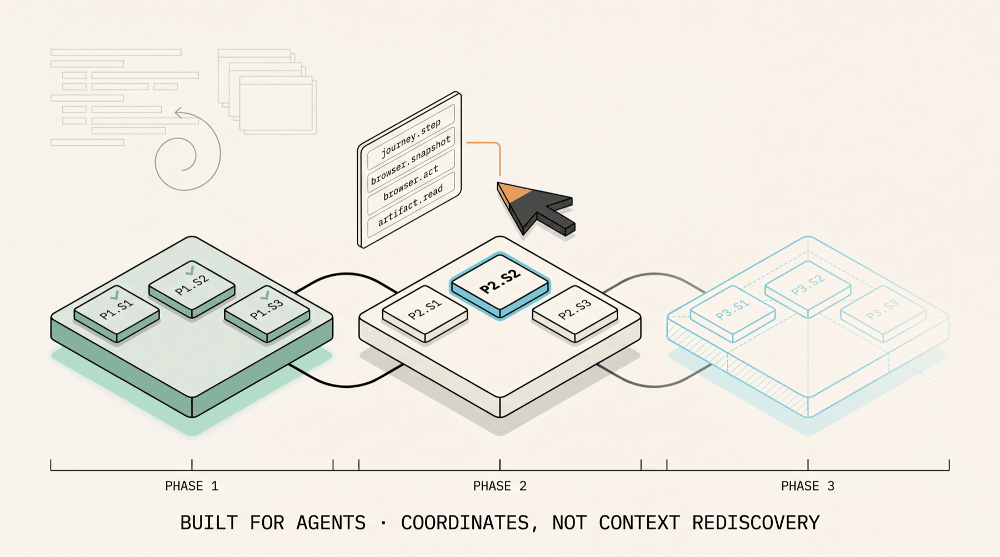
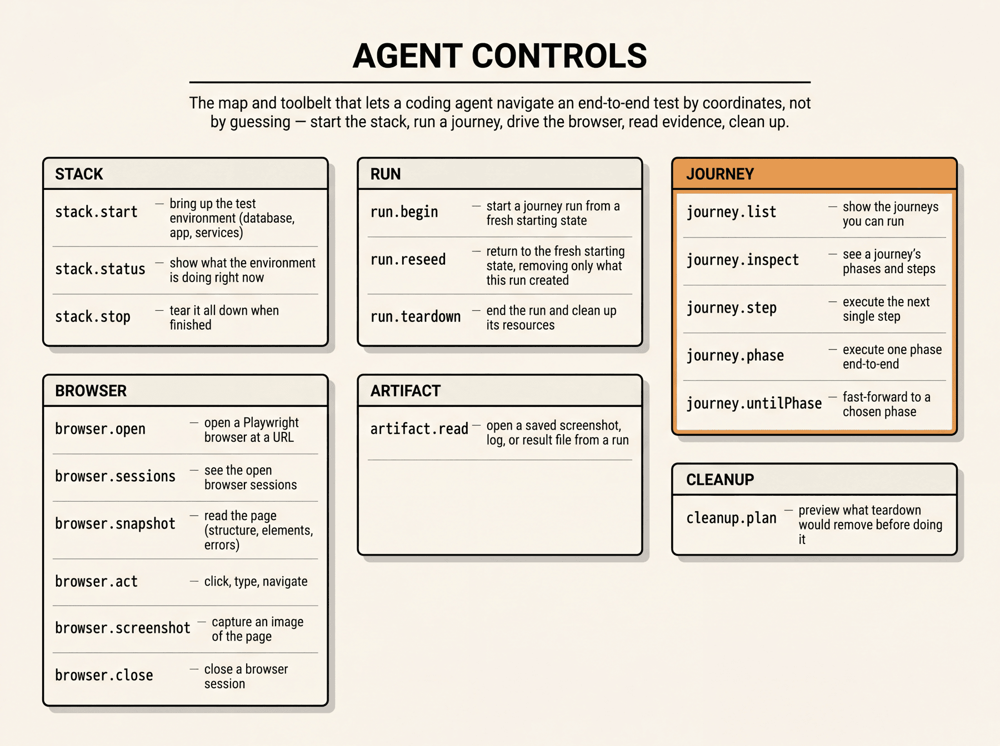
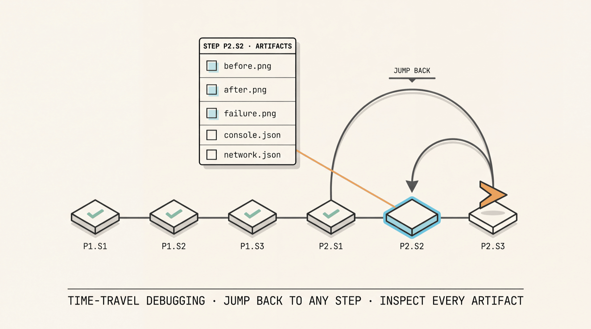

# Agent E2E Harness

Agent E2E Harness helps coding agents prove their own work.

Journeys give agents a repeatable way to seed app state, start the stack, move through UI/API steps, capture artifacts, clean owned data, and rerun from a known point. The outcome is practical time travel for app state: the agent can go back to a clean checkpoint, inspect what changed, and turn the passing journey into the same CI check humans review.



_A journey starts from seeded state, runs through MCP-controlled steps, and leaves artifacts CI can replay._

The agent is the primary user. Humans and CI read the same evidence the agent left behind.

## Install in 5 minutes

The quick path is: install the adoption skill for your agent, install the package, declare a config, start the Dev MCP server, and connect your agent to it. The journey is the domain code. The rest is one CLI command and an `agent-e2e.config.ts`.

There are three names to keep straight:

| Thing | Name |
| --- | --- |
| npm package | `@agent-e2e/harness` |
| adoption skill / repository | `agent-e2e-harness` |
| CLI binary | `agent-e2e` |

**1. Install the adoption skill for your agent.** This gives Codex the setup, journey-building, Dev MCP, and CI verification workflow as a reusable skill.

```sh
npx skills add aitoroses/agent-e2e-harness --skill agent-e2e-harness --agent codex -y
```

For every supported local agent:

```sh
npx skills add aitoroses/agent-e2e-harness --skill agent-e2e-harness --all
```

Then ask your agent to use `$agent-e2e-harness` in the app you want to instrument.

**2. Install the harness and its runtime peers.**

```sh
npm install -D @agent-e2e/harness playwright @modelcontextprotocol/sdk zod
```

Expected output line:

```text
added N packages
```

**3. Install Bun `>=1.3.0`.** The Dev MCP CLI runs on Bun so `agent-e2e.config.ts` loads directly and the journey registry can hot-reload behind a stable MCP URL.

```sh
bun --version
```

Expected:

```text
1.3.0
```

**4. Add the `dev:mcp` script** to the app's `package.json`:

```json
{
  "scripts": {
    "postinstall": "playwright install chromium",
    "dev:mcp": "agent-e2e dev",
    "e2e:verify": "agent-e2e verify"
  }
}
```

Verify:

```sh
npm pkg get scripts.dev:mcp
```

Expected:

```text
"agent-e2e dev"
```

**5. Drop an `agent-e2e.config.ts` at the app root** with at least one journey, a stack provider, and a typed resource registry. The examples below show the shapes.

**6. Start Dev MCP.** Run:

```sh
npm run dev:mcp
```

Expected line in the server log:

```text
Agent E2E Dev MCP ready
```

That log proves the MCP server booted. It is not a proof run yet. A development proof must call MCP tools, create/read artifacts, and prove cleanup or reseed.

Then connect Codex, Claude Code, or any other Streamable HTTP MCP client to `http://127.0.0.1:3766/mcp`. The agent should see the fixed stack grammar in its MCP tools:

```text
stack.start
stack.status
stack.stop
stack.logs
stack.explore.list
stack.explore.run
```

`stack.status` is the unified stack-state packet: services, stable service ids, endpoints, checks, warnings, errors, artifacts, and next actions. There are no native `stack.services`, `stack.health`, or `stack.env` tools in v1. Runtime-specific inspection is provider-owned through `stack.explore.*`.

## Build the proof loop

These six examples cover the full loop: define the journey, register typed resources, wire `agent-e2e.config.ts`, connect an agent through MCP, read run artifacts, and promote the same journey suite to CI.

### 1. Define a journey

The journey is the inspectable contract plus executable step handlers. Profiles, phases, steps, and proofs are data. Step `execute` and proof `check` are TypeScript handlers that bind to the execution surface declared in `HarnessTypes`.

```ts
import { defineJourney, type HarnessTypes } from "@agent-e2e/harness/core";

interface NotesObserved {
  noteId: string;
  noteVisible: boolean;
}

type NotesHarness = HarnessTypes<
  { appUrl: string },
  Record<string, never>,
  NotesObserved,
  { kind: "note"; id: string }
>;

export const createNoteJourney = defineJourney<NotesHarness>({
  id: "notes:create",
  title: "Create a note from the UI",
  profiles: [{ id: "default", isDefault: true, data: {} }],
  seed: async () => ({
    environment: {
      checked: [{ kind: "workspace", id: "agent-proof" }],
      created: [],
      forbidden: [{ kind: "note", id: "agent-created-note" }],
    },
  }),
  phases: [
    {
      id: "phase:notes",
      title: "Notes",
      steps: [
        {
          id: "step:create-note",
          title: "Create a note and verify it persists",
          execute: async ({ execution, runId }) => {
            const note = await execution.notes.findByTitle("Agent proof note");
            return {
              status: note ? "passed" : "failed",
              observed: { noteVisible: Boolean(note), noteId: note?.id ?? "" },
              ownedResources: note ? [{ kind: "note", id: note.id }] : [],
            };
          },
          proofs: [
            {
              id: "proof:note-visible",
              title: "The created note is visible in the app",
              check: ({ observed }) => observed.noteVisible === true,
            },
          ],
        },
      ],
    },
  ],
});
```

### 2. Register typed resources

The typed resource registry is the canonical v1.0 wiring. `defineResourceKind` types the creation input and binds the destruction mechanic. `createResourceRegistry` bundles kinds so `defineAgentE2EConfig` can resolve cleanup across every journey in the config.

```ts
import {
  createResourceRegistry,
  defineResourceKind,
} from "@agent-e2e/harness/core";

interface CreateNoteInput {
  baseUrl: string;
  body: string;
  runId: string;
}

interface OwnedNote {
  kind: "note";
  id: string;
  baseUrl: string;
}

const noteKind = defineResourceKind({
  kind: "note",
  create: async (input: CreateNoteInput): Promise<OwnedNote> => {
    const res = await fetch(`${input.baseUrl}/api/notes`, {
      method: "POST",
      headers: { "content-type": "application/json" },
      body: JSON.stringify({ body: input.body, runId: input.runId }),
    });
    if (!res.ok) throw new Error(`create note ${res.status}`);
    const { note } = await res.json() as { note: { id: string } };
    return { kind: "note", id: note.id, baseUrl: input.baseUrl };
  },
  delete: async (resource: OwnedNote) => {
    const res = await fetch(`${resource.baseUrl}/api/notes/${resource.id}`, {
      method: "DELETE",
    });
    if (!res.ok) throw new Error(`delete note ${resource.id} ${res.status}`);
  },
});

export const notesResourceRegistry = createResourceRegistry([noteKind]);
```

### 3. Add `agent-e2e.config.ts`

`agent-e2e.config.ts` is the project integration point. It is the only file the Dev MCP CLI needs to load journeys, resources, and stack lifecycle.

```ts
import { defineAgentE2EConfig } from "@agent-e2e/harness/dev-mcp";
import { createNoteJourney } from "./journeys/notes-create.js";
import { notesResourceRegistry } from "./resources.js";
import { myStackProvider } from "./stack.js";

export default defineAgentE2EConfig({
  journeys: [createNoteJourney],
  resourceRegistry: notesResourceRegistry,
  stackProvider: myStackProvider,
  verify: {
    suites: [
      { id: "smoke", journeys: ["notes:*"] },
      { id: "regression", tags: ["regression"], allProfiles: true },
    ],
  },
});
```

The same config drives both `agent-e2e dev` and `agent-e2e verify`. The lower-level `resourceAdapters: [...]` field is still accepted for one-off cleanup mechanics that do not fit a typed kind; the registry is the canonical pattern.

### 4. Connect an agent to Dev MCP

The Dev MCP server is a standard Streamable HTTP MCP endpoint. Use the agent's MCP config instead of writing a client script. Start `npm run dev:mcp`, then attach your agent to `http://127.0.0.1:3766/mcp`.



_The Dev MCP server exposes stack, run, journey, browser, artifact, and cleanup tools through one surface._

Codex CLI:

```sh
codex mcp add agent-e2e --url http://127.0.0.1:3766/mcp
codex mcp get agent-e2e
```

Equivalent Codex config:

```toml
[mcp_servers.agent-e2e]
url = "http://127.0.0.1:3766/mcp"
```

Claude Code, project-scoped:

```sh
claude mcp add --scope project --transport http agent-e2e http://127.0.0.1:3766/mcp
claude mcp get agent-e2e
```

Once connected, ask the agent to use the `agent-e2e` MCP server:

```text
Inspect the notes:create journey, start the app stack, begin a run, open the browser, execute the create-note step, read the step artifact, then plan cleanup and reseed.
```

That prompt maps to standard MCP tool calls:

```text
journey.list
journey.inspect
stack.start
stack.status
stack.logs
stack.explore.list
stack.explore.run
run.begin
browser.open
browser.snapshot
journey.step
artifact.read
cleanup.plan
run.reseed
```

Use `stack.logs` for live service logs after the stack is active. It requires one `serviceId`, a required `tail`, and optional `stream`. Use `stack.explore.list` to discover provider-declared tools and `stack.explore.run` to run one of them with Zod-validated input/output.

`journey.inspect` returns the full contract for one journey: phases, steps, proofs, profiles, and descriptions. Agents use it to plan, humans use it to read, and CI uses it to diff.

For a fresh or remote agent session that does not already have this MCP server registered, use `mcporter` as a portable dynamic client. Local HTTP endpoints require `--allow-http`:

```sh
mcporter list http://127.0.0.1:3766/mcp --schema --json --allow-http

mcporter call \
  --http-url http://127.0.0.1:3766/mcp \
  --allow-http \
  --tool stack.explore.list \
  --args '{}' \
  --output json
```

Prefer the `--http-url ... --tool ...` form for localhost. Do not rely on dotted URL selector shapes such as `http://127.0.0.1:3766/mcp.journey.list`.

### 5. Read the artifacts a run left behind

Every phase and step writes evidence under `.agents-e2e/artifacts/<journey>/<run>/`. The layout is contractual, and agents and CI can read the same filenames. `artifact.read` returns a typed packet without the agent having to know filesystem internals.

```json
{
  "runId": "<runId from run.begin>",
  "path": "01-phase-phase:notes/01-step-step:create-note/step-feedback.json"
}
```

The on-disk layout, in the order an agent typically reaches for it:

```text
.agents-e2e/artifacts/<journey>/<run>/
  seed-manifest.json
  result.json
  timeline.json
  metrics.json
  owned-resources.json
  cleanup-plan.json
  cleanup.json
  forensics/browser-snapshot-*.json
  forensics/screenshot-*.png
  01-phase-<phase-id>/01-step-<step-id>/
    before.png
    after.png
    failure.png
    console.json
    network.json
    result.json
    step-feedback.json
```

Together with seed, cleanup, and reseed, these artifacts let the agent move through app state deliberately: inspect a failure, return to a known point, and rerun the same step without inventing a new test path.

### 6. Promote journeys with verify

A development run becomes CI proof when `agent-e2e verify` reruns the configured journeys from clean seed, non-interactively, with no agent in the loop. The command uses the same `agent-e2e.config.ts`, starts the configured stack once for the suite, creates an isolated Playwright context/page for each selected run, cleans owned resources, and writes one suite report directory.

Verify runs the crystallized journey. It does not expose arbitrary Dev MCP exploration or generic shell execution. Journey code can use only Verify Observation Tools through `execution.stack.explore.run(...)`: provider-declared tools with `availableIn: ["dev", "verify"]` and `risk: "none"`. Product-visible mutations must still come from the app path, seed, journey steps, reseed, or cleanup.

```sh
agent-e2e verify
agent-e2e verify --suite smoke
agent-e2e verify --journey "notes:*" --profile default
agent-e2e verify --all-profiles --workers 4 --reporter github
```

By default, verify runs every configured journey with its default profile. Named suites, journey globs, tags, excludes, profiles, `--all-profiles`, `--workers`, `--fail-fast`, and `--warnings-as-errors` tune that selection without a second Playwright wrapper.

GitHub Actions can stay small:

```yaml
- run: npm ci
- run: npx agent-e2e verify --reporter github
- uses: actions/upload-artifact@v4
  if: always()
  with:
    name: agent-e2e-artifacts
    path: .agents-e2e/artifacts/_suites
```

When verify passes, the journey suite is the CI E2E test. There is no second test file to maintain.



_A development run becomes a CI check without changing the journey._

## Why this

Most E2E tools are built around human-authored tests. This harness is built around agent-authored proof: the agent runs the workflow, records what happened, moves app state through seed and reseed, and leaves CI with the same contract.

| Concern                                | Hand-rolled Playwright | Playwright codegen        | Cypress AI / recorder      | **Agent E2E Harness**                                |
| -------------------------------------- | ---------------------- | ------------------------- | -------------------------- | ---------------------------------------------------- |
| Primary user                           | Human author           | Human author              | Human author               | Coding agent in dev mode                             |
| Seeded environment as a gate           | Ad-hoc fixtures        | None                      | None                       | **Environment Seed** + **Seed Gate** + warnings      |
| Discovery surface for the agent        | Read the test file     | Read the recorded file    | Read the recording         | **Inspectable Journey Contract** via `journey.inspect` |
| Step-by-step debug from one MCP call   | Rerun the whole spec   | Rerun the whole recording | Rerun the whole recording  | `journey.step`, `journey.phase`, `journey.untilPhase` |
| Time-travel app state while debugging  | Manual reset scripts   | Rerun from the start      | Rerun from the start       | Seed, inspect, cleanup, reseed, and rerun            |
| Bounded teardown of agent-created data | Cleanup blocks (best-effort) | None              | None                       | **Ownership Ledger** + **Resource Adapter** + reseed |
| Same artifact in dev and CI            | Maybe                  | Maybe                     | Recordings drift           | `agent-e2e verify` runs the same journey suite       |
| Proof status after development         | Test passed            | Test passed               | Recording passed           | **Verified proof** with Markdown and JSON reports    |

Three honest trade-offs:

- **You write more upfront.** A journey defines profiles, seed, phases, steps, proofs, and a resource registry. That is more than a Playwright spec or a codegen capture. The payoff is the agent can debug, reseed, and rerun without rewriting any of it, and there is no second test artifact when the proof becomes CI.
- **You take a runtime dependency on Bun for the CLI.** The CLI loads `agent-e2e.config.ts` directly so Dev MCP can hot-reload behind a stable URL and verify can run from the same config in CI.
- **You commit to the harness's domain model.** Journeys, profiles, owned resources, feedback envelopes, and observed payloads are opinionated shapes. If you only need to record a happy path once, codegen is shorter. If you need an agent to discover, debug, fix, and promote a flow without re-explaining it every time, the model pays for itself.

## Public package surfaces

The v1.0 package exports six entries. All are stable.

- `@agent-e2e/harness` - default Playwright-specialized API. Re-exports `/core` plus `definePlaywrightJourney`, `PlaywrightExecutionSurface`, and the Playwright-bound journey types.
- `@agent-e2e/harness/core` - core API: `defineJourney`, `HarnessTypes`, inspectable contract types, feedback and guidance types, seed contracts, ownership and resource cleanup contracts, typed resource registry helpers, and journey run helpers.
- `@agent-e2e/harness/dev-mcp` - Dev MCP server facade: `defineAgentE2EConfig`, `startAgentE2EDevMcpFromConfig`, manifest types, defaults (`127.0.0.1:3766/mcp`, `.agents-e2e/artifacts`), and the Dev MCP tool grammar types.
- `@agent-e2e/harness/verify` - config-backed verify runner, suite selection types, report types, built-in reporters, and `runAgentE2EVerifyFromConfig`.
- `@agent-e2e/harness/playwright-mcp` - MCP-owned browser session factory and the `browser.open` / `browser.snapshot` / `browser.act` / `browser.screenshot` / `browser.close` packet types.
- `@agent-e2e/harness/stack` - stack provider contract, `StackStatusPacket`, `StackLifecyclePhase`, `createProcessStackProvider`, `allocateTcpPort`.
- `@agent-e2e/harness/artifacts` - artifact recorder and reader helpers: `createRunArtifacts`, `createRunArtifactRecorder`, `readArtifact`, `resolveArtifactPath`, canonical filenames, and `DEFAULT_AGENT_E2E_ARTIFACT_ROOT`.

The reference CLI is `agent-e2e`. It exposes `agent-e2e dev` for Dev MCP and `agent-e2e verify` for CI. Both accept `--config`, `--cwd`, and `--artifact-root`; `dev` also accepts `--host`, `--port`, and `--path`, while `verify` adds selectors, profiles, workers, reporters, cleanup mode, fail-fast, and warning strictness.

## Showcase app

`apps/showcase` is a Proof Notes app built through its own journeys, against Testcontainers PostgreSQL plus `next dev`. It consumes the public package surfaces exactly as a downstream app would.

```sh
npm run dev:mcp --workspace @agent-e2e/showcase
```

See `apps/showcase/README.md` for the showcase build narrative.

## Repository map

- `packages/harness` - the published library.
- `apps/showcase` - the reference app and dogfood proof.
- `skills/agent-e2e-harness` - the adoption skill for another repo.
- `docs/architecture` - package, export, and layout decisions.
- `docs/showcase` - MCP grammar, proof transcript, and seed/ownership docs.
- `docs/adr` - architectural decision records.
- `CONTEXT.md` - the full domain vocabulary this README uses.

## Development

```sh
npm install
npm run check
```

Targeted commands:

```sh
npm run typecheck
npm run build
npm test --workspace @agent-e2e/harness
npm run build --workspace @agent-e2e/showcase
```
